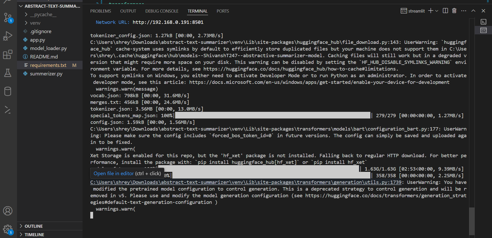
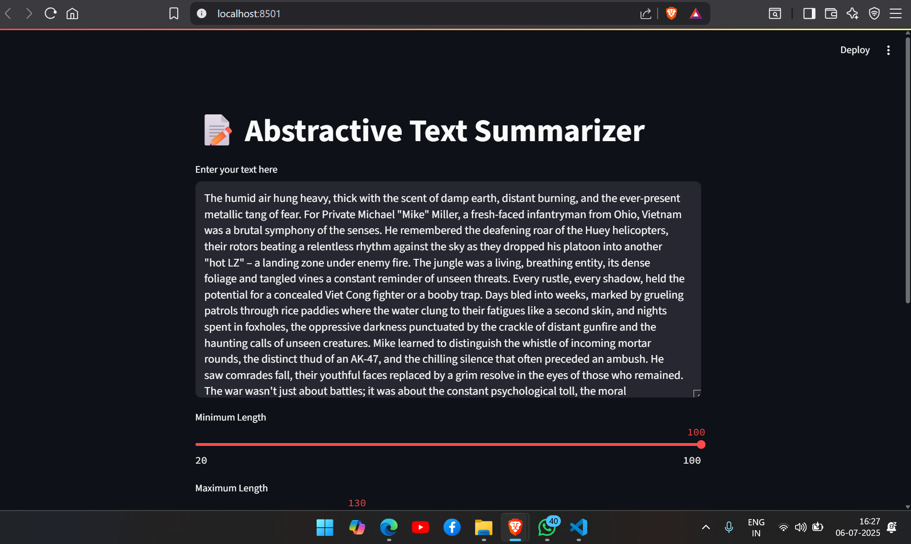
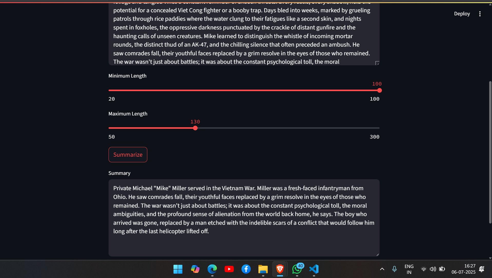

# 📝 Abstractive Text Summarizer

This project is a simple and efficient **abstractive text summarization app** built with **Streamlit** and a **fine-tuned Hugging Face model**.

## 🔍 Features

* Generate high-quality summaries from long text inputs
* Adjustable `min_length` and `max_length` for summaries
* Interactive, easy-to-use Streamlit interface
* Powered by a custom fine-tuned BART-based model

---

## 🚀 Getting Started

### 1. Clone the repository

```bash
git clone https://github.com/ShivanshTripathi247/abstract-text-summarizer
cd abstractive-summarizer
```

### 2. Set up a virtual environment (optional but recommended)

```bash
python -m venv venv
source venv/bin/activate  # On Windows: venv\Scripts\activate
source venv/bin/activate  # On Windows: venv\Scripts\activate
```

### 3. Install dependencies

```bash
pip install -r requirements.txt
```

### 4. Run the app locally

```bash
streamlit run app.py
```

### 5. Enter the Email ID

```bash
shivansht06@gmail.com
```

### 5. Enter the Email ID

```bash
shivansht06@gmail.com
```

The app will open in your default browser at `http://localhost:8501/`.

## 🧠 Model Details

The model used is a fine-tuned version of BART for abstractive summarization.
The tokenizer and model files are loaded from a Hugging Face Hub repository:

[https://huggingface.co/ShivanshT247/abstractive-summarizer-model](https://huggingface.co/ShivanshT247/abstractive-summarizer-model)

## 📁 Project Structure

```
├── app.py                # Streamlit app interface
├── model_loader.py       # Loads tokenizer and model
├── summerizer.py         # Summary generation logic
├── requirements.txt      # Project dependencies
└── README.md             # This file
```

## 📸 Screenshots

Here are some screenshots demonstrating the application's functionality:

### Screenshot 1: Starting the app from Command Line Interface
[](./src/2.png)

### Screenshot 2: Input Text and Parameters
[](./src/3.png)

### Screenshot 3: Generated Summary Output
[](./src/4.png)


## 🛠️ Dependencies

* Python 3.10+
* Streamlit
* Transformers
* Torch

## 🙋‍♂️ Author

**Shivansh Tripathi**

B.Tech in Electrical & Electronics


## 📄 License

This project is open-sourced under the MIT License through Hugging Face.
